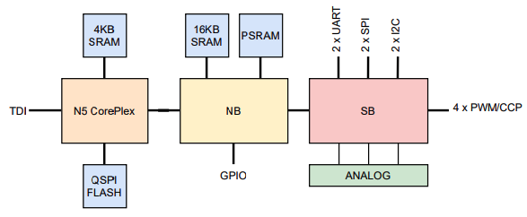

# N15_SoC
A single core modular AHB-Lite/APB based SoC. 

The SoC has 3 main components:
- CorePlex (CP): The CPU core, local SRAM, QSPI Flash Controller w/ cache, DMA Controller, Tow-Wire Debug Interface (TDI) and SPI Flash writer. All on a single master AHB-Lite bus.
- North Bridge (NB): AHB-Lite subsystem with: SRAM, PSRAM Controller, GPIO Port and APB Bridge. The NB has 2 Master ports for the CP and the DMAC.
- South Bridge (SB): APB subsystem with several peripherals: 2xUART, 2xI2C, 2xSPI, and 4xTMR/CCP/PWM). Analog peripherals to be added to the SB.

